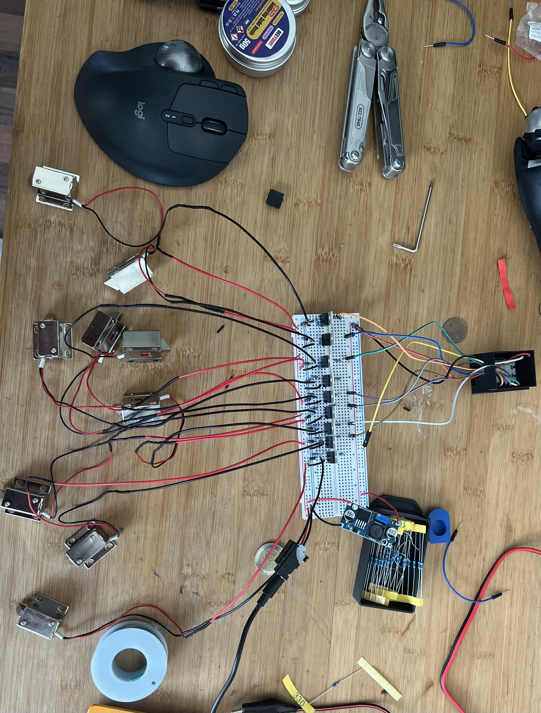

# ESP32 Smart Cabinet Lock for Dementia Care

A 3D-printed, WiFi-enabled cabinet with electronically controlled locks for assisting dementia patients.

This project was designed to help my grandmother, who suffers from dementia, by securely organizing items like money, keys, or medication into lockable compartments. Each compartment (drawer or door) is controlled via an ESP32 microcontroller and can be accessed remotely or based on a daily schedule.

---

## 🧠 Motivation

Dementia can make it difficult to remember where valuables are stored or when certain items are accessible. This project offers:

- **Controlled access** to important items.
- **Scheduled unlocking** of compartments (e.g., per weekday).
- **Remote monitoring/control** via a simple web interface.
- **Increased independence and security** for dementia patients.

---

## 🛠️ Features

- 🔒 Electronic control of **multiple cabinet locks** (NMOS-driven)
- 🌐 WiFi-based **web server** for remote control
- ⏰ **Daily timer logic**: auto-unlocks based on weekday
- 🔌 Designed for **12 V cabinet locks** with IRLZ44N MOSFET switching
- 🖨️ Compatible with **3D-printed cabinet hardware**
- ⚙️ Built using **KiCad** for circuit design

---

## 📦 Hardware Overview

- **Microcontroller**: ESP32 (ESP32-S)
- **Locks**: 12 V electronic cabinet locks (Schubstangen-Verriegelung)
- **Transistor**: IRLZ44N (logic-level NMOS)
- **Gate Resistor**: 330 Ω between GPIO and Gate
- **Pull-down Resistor**: 10 kΩ between Gate and GND
- **Power Supply**: 12 V for locks; ESP32 regulated via AMS1117

---

## 💻 Software Structure

### Web Interface (ESP32)

Accessible via browser on the local network.  
Features:

- Toggle lock states (`/moH`, `/diH`, etc.)
- All locks on/off
- Special emergency buttons (`/keyH`, `/noH`)

### Timer Logic

Uses `NTP` (`pool.ntp.org`) to fetch current weekday.  
Automatically sets the GPIO pin HIGH corresponding to the current day.

```cpp
int days[7] = {13, 14, 15, 16, 17, 18, 19}; // Monday to Sunday

### Assembly 


